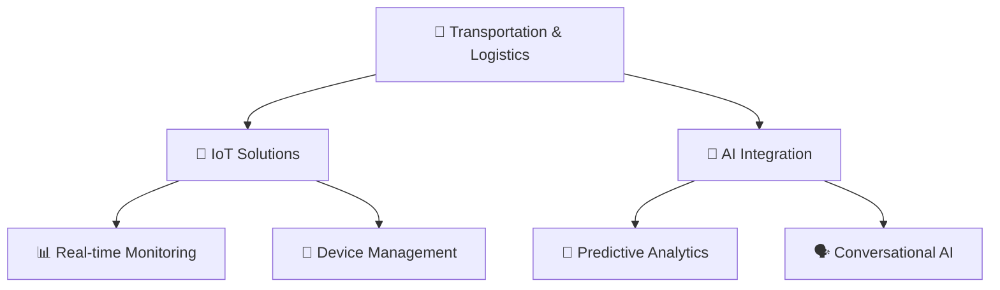

  
# 👨‍💻 Bruno Levi

### 🚀 *Empowering land transportation with IoT and AI solutions*

---

## 🛠️ Technology Stack

### 💻 Languages

### 🚀 Frontend

### ⚡ Backend

### 🗄️ Databases

### ☁️ Cloud & Infrastructure

### 🤖 AI/ML & Automation

---

## 🚀 Featured Projects

<table>
<tr>
<td width="50%">

### 🌐 [Logistica Conectada](https://logisticaconectada.com)
**Transforming logistics with IoT intelligence**
- Real-time fleet monitoring
- AI-powered route optimization  
- Connected vehicle solutions
- Data-driven logistics insights

*Technologies: IoT, NestJS, PostgreSQL*

</td>
<td width="50%">

### 📱 [Chespli](https://brunolevi.dev/projects/chespli)
**Modern IoT management platform**
- Device fleet management
- Real-time communication
- Scalable IoT architecture
- Modern responsive UI

*Technologies: Spring Boot, Angular, MongoDB, Redis*

</td>
</tr>
<tr>
<td width="50%">

### 🎙️ [Voice Engine](https://brunolevi.dev/projects/voice-engine)
**Advanced conversational AI engine**
- Natural language processing
- Multi-language support
- Real-time voice recognition
- Smart conversation flows

*Technologies: Rust, MongoDB*

</td>
<td width="50%">

### 🔗 [Zonora AI API Platform](https://brunolevi.dev/projects/zonora-api)
**Next-gen AI API ecosystem**
- Robust API architecture
- AI model management
- Scalable microservices
- Developer-friendly SDKs

*Technologies: NestJS, PostgreSQL, Docker*

</td>
</tr>
</table>

---

## 💼 Professional Focus

**Core Expertise Areas:**
- 🚚 **Land Transportation Optimization**
- 📡 **IoT Device Integration & Management** 
- 🤖 **AI-Powered Logistics Solutions**
- 📊 **Real-time Data Processing**
- 🔄 **Process Automation**

---

## 🌐 Let's Connect!

  
  
  
  

---

## 🎯 Beyond Code

  
  
  

*"Innovation happens when passion meets purpose"*

---

